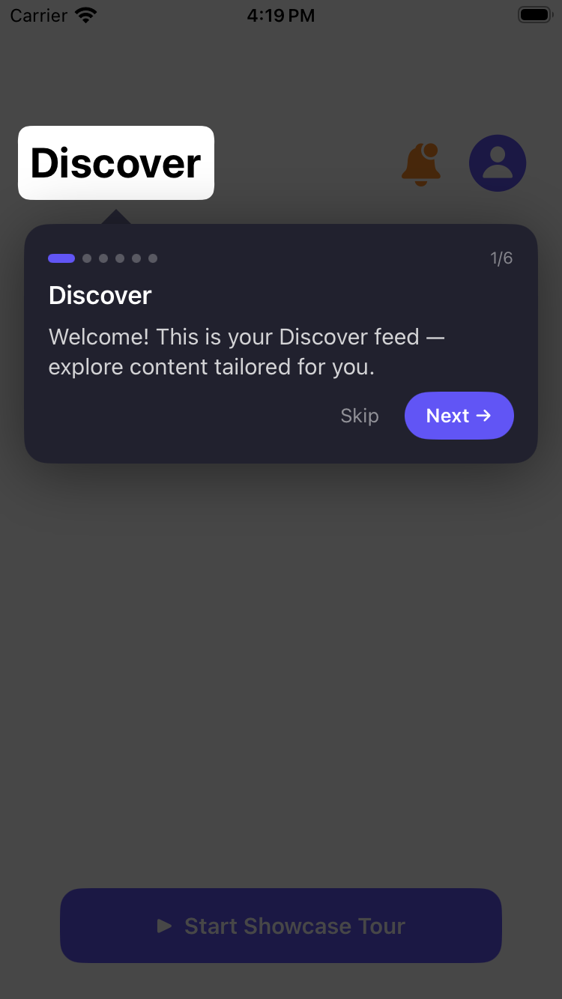
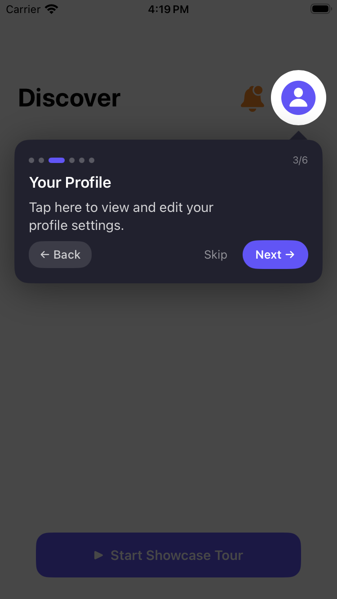
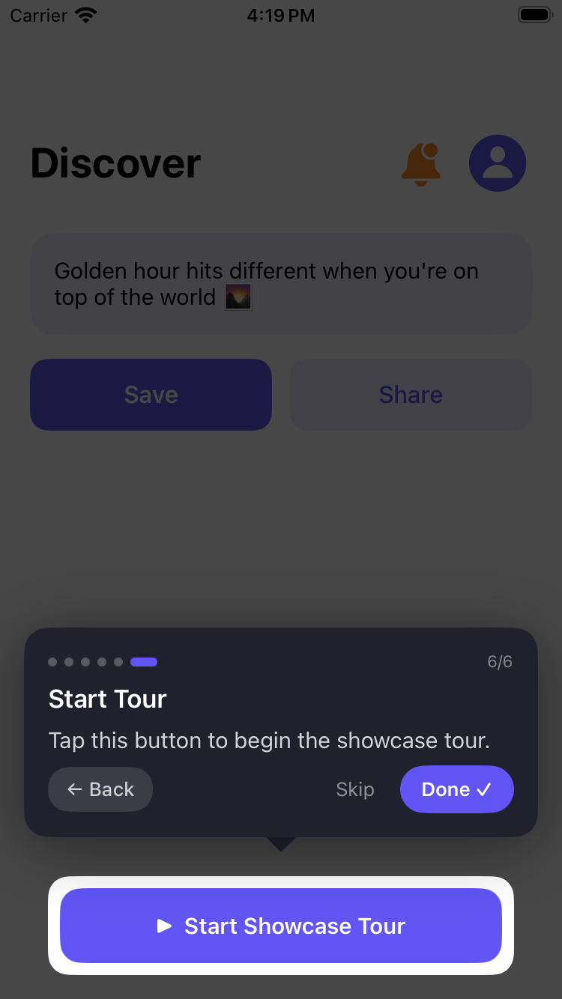

# ShowcaseKit

A lightweight UIKit & SwiftUI library to create interactive onboarding tours — highlight any UI element with a tooltip, step-by-step.


---

## Features

- ✅ Highlight any `UIView` or SwiftUI view
- ✅ Custom shapes — circle, rectangle with corner radius
- ✅ Auto tooltip positioning (above/below)
- ✅ Step dots, back/skip/next navigation
- ✅ Works with UIKit (`registerShowcase`) and SwiftUI (`ShowcaseRegistrar`)
- ✅ Zero dependencies — pure Swift

---

## Requirements

- iOS 15.0+
- Swift 5.7+
- Xcode 14+

---

## Installation

### Swift Package Manager

In Xcode: **File → Add Package Dependencies**

```
https://github.com/priyalsavaliya455/ShowcaseKit
```

Or add to your `Package.swift`:

```swift
dependencies: [
    .package(url: "https://github.com/priyalsavaliya455/ShowcaseKit", from: "1.0.0")
]
```

---

## Quick Start — UIKit

### 1. Create a controller

```swift
private let showcaseController = ShowcaseController()
```

### 2. Register views

Call in `viewDidAppear` after layout is complete:

```swift
myButton.registerShowcase(
    id: "my_button",
    title: "Save Button",
    description: "Tap here to save your changes.",
    shape: .rectangle(cornerRadius: 12),
    controller: showcaseController
)

profileImage.registerShowcase(
    id: "profile",
    title: "Your Profile",
    description: "Tap to view your account.",
    shape: .circle,
    controller: showcaseController
)
```

### 3. Start the tour

```swift
ShowcaseOverlayView.present(
    controller: showcaseController,
    orderedIDs: ["profile", "my_button"],
    completion: { print("Tour complete!") }
)
```

---

## Quick Start — SwiftUI

### 1. Add `ShowcaseRegistrar` to your project

```swift
struct ShowcaseRegistrar: UIViewRepresentable {
    let id: String
    let title: String
    let description: String
    var shape: ShowcaseShape = .rectangle(cornerRadius: 12)
    var actionButtonTitle: String? = nil
    let controller: ShowcaseController

    func makeUIView(context: Context) -> UIView {
        let view = UIView()
        view.backgroundColor = .clear
        view.isUserInteractionEnabled = false
        return view
    }

    func updateUIView(_ uiView: UIView, context: Context) {
        DispatchQueue.main.async {
            uiView.registerShowcase(
                id: id, title: title, description: description,
                shape: shape, actionButtonTitle: actionButtonTitle,
                controller: controller
            )
        }
    }
}
```

### 2. Attach to any view

```swift
private let showcase = ShowcaseController()

Button("Save") { }
    .background(
        ShowcaseRegistrar(
            id: "save_btn",
            title: "Save",
            description: "Tap to save your work.",
            controller: showcase
        )
    )
```

### 3. Start the tour

```swift
.onAppear {
    DispatchQueue.main.asyncAfter(deadline: .now() + 0.5) {
        ShowcaseOverlayView.present(
            controller: showcase,
            orderedIDs: ["save_btn"]
        )
    }
}
```

---

## Showcase Shapes

```swift
shape: .rectangle(cornerRadius: 12)   // rounded rectangle
shape: .circle                         // perfect circle
```

---

## Tooltip Position

```swift
tooltipPosition: .auto    // default — auto above/below
tooltipPosition: .above   // always above (recommended for tab bars)
tooltipPosition: .below   // always below
```

---

## Full UIKit Example

```swift
override func viewDidAppear(_ animated: Bool) {
    super.viewDidAppear(animated)

    titleLabel.registerShowcase(
        id: "title", title: "Welcome",
        description: "This is your home feed.",
        shape: .rectangle(cornerRadius: 8),
        controller: showcaseController
    )

    DispatchQueue.main.asyncAfter(deadline: .now() + 0.5) {
        ShowcaseOverlayView.present(
            controller: self.showcaseController,
            orderedIDs: ["title"],
            completion: { print("Done!") }
        )
    }
}
```

---
# ShowcaseKit

A lightweight UIKit & SwiftUI library for interactive onboarding tours.


## Screenshots

| Step 1 | Step 2 | Step 3 |
|--------|--------|--------|
|  |  |  |

## Installation

In Xcode: **File → Add Package Dependencies**
